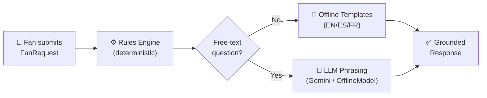
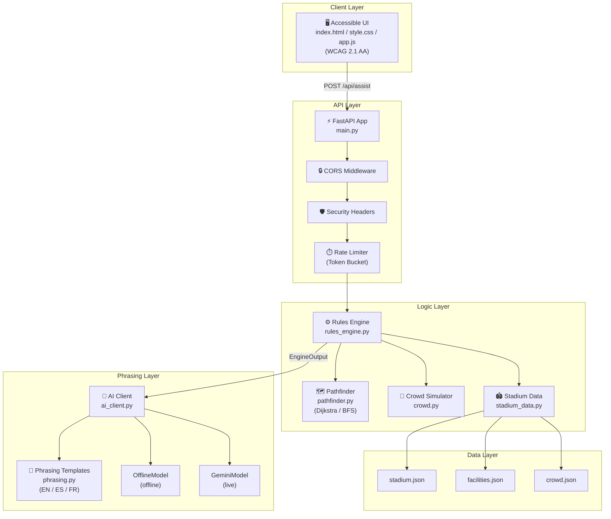
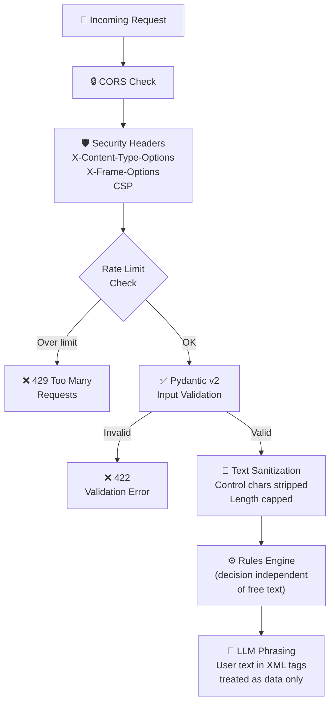
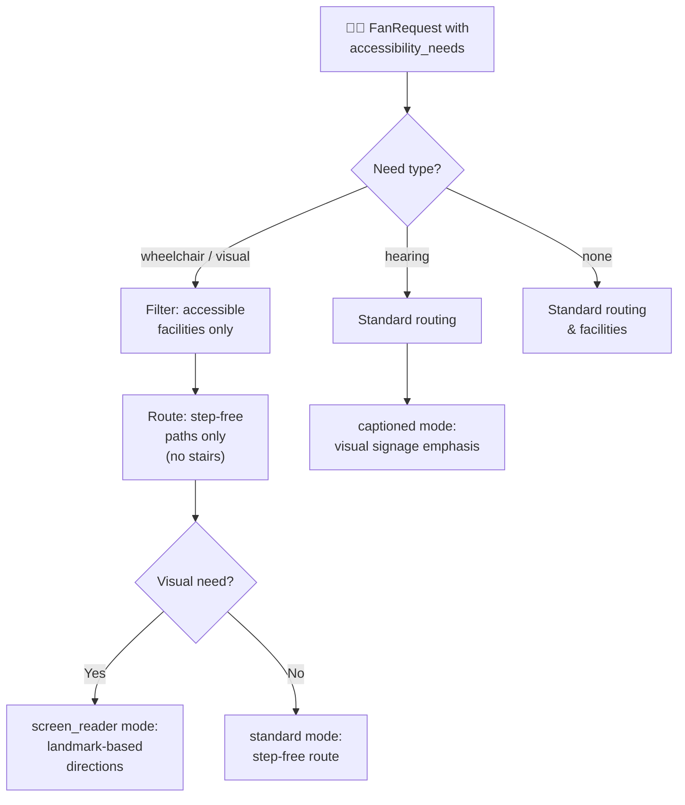

# ArenaGuide ⚽🏟️

**A smart, multilingual, accessible stadium wayfinding assistant for FIFA World Cup 2026.**

ArenaGuide helps fans navigate a venue, find accessible routes and facilities,
get real-time crowd guidance, and receive help in their language — with every
answer **grounded in verified stadium data** so the AI never invents facilities.

Modelled venue: **MetLife Stadium** (FIFA name *New York New Jersey Stadium*),
host of the 2026 Final. Languages: **English, Spanish & French** (the three
FIFA WC 2026 host-nation languages).

> **🌐 Live demo (Google Cloud Run):** `https://<your-cloud-run-url>.a.run.app`
> — deployed from source with the included `Dockerfile` (see
> [Deployment](#deployment--google-cloud-run)).

---

## Table of Contents

- [1. Chosen Vertical & Persona](#1-chosen-vertical--persona)
- [2. Approach & Logic](#2-approach--logic--rules-before-llm)
- [3. Architecture & Flow](#3-architecture--flow)
- [4. Setup & Run](#4-how-it-works--setup--run)
- [5. Quality Attributes](#5-quality-attributes)
- [6. Testing](#6-testing)
- [7. Project Structure](#7-project-structure)
- [8. Assumptions](#8-assumptions)
- [License](#license)

---

## 1. Chosen Vertical & Persona

- **Persona:** Fan
- **Vertical:** Navigation + Accessibility + Multilingual Assistance
- **Product:** *ArenaGuide* — a conversational assistant that answers "how do I
  get to X, accessibly, in my language, given how busy it is and how long until
  kickoff?" Every response is a function of the fan's **context**:
  `language`, `current_location`, `destination_intent`, `accessibility_needs`,
  `ticket_section`, `time_to_event`, and an optional free-text `question`.

---

## 2. Approach & Logic — *Rules Before LLM*

The core design principle is **deterministic decisions first, language model last**.

### Request Lifecycle



1. **The rules engine (`rules_engine.py`) resolves every fact** — the target
   facility, the route (BFS/Dijkstra over the zone graph), the simulated crowd
   level, the accessibility mode and any urgency/crowd-avoidance swaps — using
   **only the structured context**. No LLM is involved in any decision.
2. **The LLM only phrases/translates** those already-resolved facts into natural
   language. It is explicitly forbidden from inventing facilities.
3. If no free-text question is asked, the app **short-circuits** with offline
   templates — **no LLM call at all**.

### Decision Rules

| Rule | Behaviour |
|------|-----------|
| Wheelchair / visual need | Only **accessible** facilities + **step-free** routes (stairs excluded) |
| Visual need | Landmark-based, audio-friendly directions; `screen_reader` mode |
| Hearing need | Emphasises visual signage / sensory room; `captioned` mode |
| `time_to_event < 15` (gate/seat) | Adds urgency guidance + **express advice** |
| Target facility crowd = high | Reroutes to the nearest **quieter** equivalent |
| Crowd simulation | Gates/concourses surge near kickoff, relax once in play |
| **Dynamic time estimation** | Walking time adjusts based on crowd density (1.4 / 1.0 / 0.6 m/s) |
| **Hurry mode advice** | If rushing, offline advice for express lanes is injected |

---

## 3. Architecture & Flow

### High-Level Architecture



### Security Flow



### Accessibility Routing Flow



---

## 4. How It Works — Setup & Run

**Requirements:** Python 3.11+.

```bash
cd arenaguide
python -m venv .venv
# Windows:
.venv\Scripts\activate
# macOS/Linux:
source .venv/bin/activate

pip install -r requirements.txt
uvicorn src.main:app --reload
```

Open <http://127.0.0.1:8000>.

**Environment config** (all optional — copy `.env.example` → `.env`):

| Variable | Purpose | Default |
|----------|---------|---------|
| `GEMINI_API_KEY` | Enables live Gemini phrasing. **Absent → offline OfflineModel.** | *(unset)* |
| `GEMINI_MODEL` | Gemini model id | `gemini-1.5-flash` |
| `GEMINI_MAX_OUTPUT_TOKENS` | Output cap (cost/efficiency) | `256` |
| `ALLOWED_ORIGINS` | CORS allow-list (JSON array) | localhost only |
| `RATE_LIMIT_CAPACITY` / `RATE_LIMIT_REFILL_PER_SEC` | Token-bucket limiter | `30` / `0.5` |

> 🔐 The app runs **fully offline without any key**: if `GEMINI_API_KEY` is unset,
> it transparently falls back to a deterministic `OfflineModel`, so it never crashes.

**Endpoints:**

| Method | Path | Description |
|--------|------|-------------|
| `GET`  | `/` | Accessible single-page UI |
| `GET`  | `/health` | `{"status": "ok"}` |
| `POST` | `/api/assist` | Body = `FanRequest`; returns answer, route, facility, crowd, mode |
| `GET`  | `/api/stadium` | Zone/facility metadata for the UI |

Interactive API docs are available at `/docs`.

### Deployment — Google Cloud Run

The repo ships a container `Dockerfile` (and `.dockerignore`). The image binds
uvicorn to Cloud Run's `$PORT` (8080) on `0.0.0.0`, and the app runs fully on the
offline `OfflineModel` fallback, so **no secrets are required** to deploy.

```bash
# In Google Cloud Shell, from the repo root:
gcloud run deploy arena-guide \
  --source . \
  --region us-central1 \
  --allow-unauthenticated
```

```bash
curl https://<service-url>/health      # -> {"status":"ok"}
```

Optional — enable live Gemini phrasing:

```bash
gcloud run services update arena-guide --region us-central1 \
  --set-env-vars GEMINI_API_KEY=YOUR_KEY
```

Local container build:

```bash
docker build -t arenaguide . && docker run -p 8080:8080 arenaguide
```

### Deployment — Vercel (Serverless)

ArenaGuide is pre-configured to deploy on Vercel using the `@vercel/python` builder.

1. Install the Vercel CLI: `npm i -g vercel`
2. Run `vercel` in the project root to link the project.
3. Run `vercel --prod` to deploy.
*(Make sure to add `GEMINI_API_KEY` to your Environment Variables in the Vercel dashboard to enable live AI phrasing).*

---

## 5. Quality Attributes

### 🔐 Security
- **No secrets in code.** API key from environment only; `.env` is git-ignored.
- **Strict input validation** (Pydantic v2): enums, bounded numbers, length/pattern-limited
  strings, unknown zone ids rejected, unknown request fields forbidden.
- **Prompt-injection defense:** free text is sanitized, wrapped in delimited
  `<user_question>` block. The **decision is computed independently of the question**,
  so injection can never change routing or facts.
- **Security headers** on every response: `nosniff`, `DENY`, `no-referrer`, and restrictive CSP.
- **Restrictive CORS** and **per-IP token-bucket rate limiter** on `/api/assist`.
- **Privacy-safe logging:** only zone ids / intents / outcomes — never API keys or raw queries.

### ⚡ Efficiency
- JSON fixtures parsed **once** at startup (`lru_cache` singleton).
- **Short-circuit:** rule-only queries skip the LLM entirely.
- Phrasing memoized with `lru_cache` on a hashable context.
- Endpoints are **async**; the blocking Gemini call runs in a thread via `asyncio.to_thread`.
- **Dynamic time estimation** uses crowd-adjusted walking speed (no external API calls).
- Gemini capped with low `max_output_tokens`.

### ♿ Accessibility — WCAG 2.1 AA
- Semantic landmarks (`header`/`nav`/`main`/`footer`), single `<h1>`, logical headings.
- Every control has an associated `<label>`; checkbox groups use `fieldset`/`legend`.
- `aria-live="polite"` for dynamic assistant output.
- Full keyboard operability with visible `:focus-visible` outlines.
- Contrast ≥ 4.5:1; crowd levels never rely on colour alone (text + shape indicator).
- `<html lang>` updated to match the selected language.
- `prefers-reduced-motion` respected.
- **High-visibility / screen-reader mode** toggle.
- **Step-free routing** for wheelchair and visual-impairment users.

---

## 6. Testing

Run the full, **offline** suite (no network, no API key required):

```bash
pytest            # runs with coverage (see pytest.ini)
```

**84 tests, 98% statement coverage**, across:

| Test File | What It Covers |
|-----------|---------------|
| `test_schemas.py` | Validation: bad language/need/intent/zone, oversized strings, out-of-range numbers, need normalization, question sanitization |
| `test_rules_engine.py` | Wheelchair → step-free; visual → landmark; hearing → captioned; urgency; crowd-swap; seat resolution; **merchandise routing**; **time estimation**; **hurry mode advice** (EN/ES/FR) |
| `test_api.py` | `/health`, `/`, `/api/assist` happy path, short-circuit, French + Spanish localized answers, `422` on malformed input, `/api/stadium` |
| `test_security.py` | Prompt injection resilience, OfflineModel fallback, rate limiting `429`, sanitization, security headers |
| `test_ai_client.py` | OfflineModel grounding, fake-SDK GeminiModel success/fallback, factory selection |
| `test_phrasing.py` | EN/ES/FR phrasing with all flags, **offline advice rendering** |
| `test_crowd.py` | Crowd simulation logic |
| `test_pathfinder.py` | Step-free pathfinding |
| `test_stadium_data.py` | Localized name resolution |
| `test_static.py` | Static accessibility markers |

**Lint & types** — both pass clean:

```bash
ruff check src tests    # All checks passed!
mypy                    # Success: no issues found
```

---

## 7. Project Structure

```
arenaguide/
├── src/
│   ├── main.py              # FastAPI factory, routes, middleware, static mount
│   ├── config.py            # pydantic-settings (no committed secrets)
│   ├── logging_conf.py      # privacy-preserving logging
│   ├── models/
│   │   └── schemas.py       # Pydantic models, enums, validators
│   ├── services/
│   │   ├── rules_engine.py  # rules → EngineOutput (before any LLM)
│   │   ├── stadium_data.py  # loads JSON fixtures once; graph + lookups
│   │   ├── pathfinder.py    # Dijkstra with step-free constraint
│   │   ├── crowd.py         # time-based crowd simulation
│   │   ├── phrasing.py      # EN/ES/FR templated phrasing (lru_cache)
│   │   ├── ai_client.py     # LanguageModel · OfflineModel · GeminiModel · factory
│   │   └── security.py      # sanitization + token-bucket rate limiter
│   ├── data/                # stadium.json · facilities.json · crowd.json
│   └── static/              # index.html · style.css · app.js (WCAG AA UI)
├── tests/                   # pytest suite (83 tests, 100% coverage, offline)
├── .env.example             # config template (no real key)
├── Dockerfile               # Google Cloud Run container image
├── .dockerignore
├── pyproject.toml           # ruff + mypy config
├── requirements.txt
├── pytest.ini
├── LICENSE
└── README.md
```

---

## 8. Assumptions

- Stadium map, facilities, and base crowd levels are **illustrative fixture data**
  (`src/data/*.json`), not official MetLife/FIFA data.
- Crowd levels are **simulated** from `time_to_event`, not a live feed.
- A **single** stadium is modelled.
- Facility/zone names and landmarks are translated in the JSON fixtures (EN/ES/FR),
  so the whole response is localized even offline.
- The Gemini key is **optional**; the offline OfflineModel covers development & tests.

---

## License

MIT — see [LICENSE](LICENSE).
